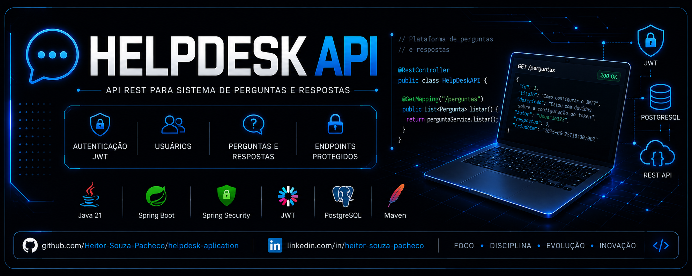

<p align="center">
  
</p>

<p align="center">
  <strong>API REST para uma plataforma de perguntas e respostas com autenticação JWT.</strong>
</p>

<p align="center">
  
  
  
  
  
  
</p>

---

# 💬 Sobre o projeto

O **HelpDesk API** é uma API REST desenvolvida em **Java 21 e Spring Boot** para uma plataforma de perguntas e respostas.

O projeto possui sistema de **autenticação e autorização utilizando JWT**, gerenciamento de usuários e persistência de dados utilizando **PostgreSQL, Spring Data JPA e Hibernate**.

A aplicação foi desenvolvida com foco em práticas de desenvolvimento backend, organização de código, segurança e construção de APIs REST.

---

## 🎯 Objetivos

- Desenvolver uma API REST utilizando Spring Boot.
- Implementar autenticação utilizando JWT.
- Trabalhar com Spring Security.
- Integrar a aplicação com PostgreSQL.
- Utilizar Spring Data JPA e Hibernate.
- Desenvolver operações CRUD.
- Criar endpoints protegidos por autenticação.
- Preparar a aplicação para execução utilizando Docker.

---

# ✨ Funcionalidades

## 🔐 Autenticação

- Cadastro de usuários.
- Login.
- Geração de token JWT.
- Validação de token.
- Proteção de endpoints.
- Controle de acesso utilizando Spring Security.

## 👤 Usuários

- Listagem de usuários.
- Criação de usuários.
- Atualização de usuários.
- Exclusão de usuários.

## 💬 Sistema HelpDesk

Estrutura desenvolvida para uma plataforma de perguntas e respostas, permitindo a evolução da aplicação para recursos como:

- Perguntas.
- Respostas.
- Usuários.
- Categorias.
- Interações entre usuários.

---

# 🛠️ Tecnologias utilizadas

| Tecnologia | Utilização |
|---|---|
| ☕ Java 21 | Linguagem principal |
| 🌱 Spring Boot 4.0.6 | Desenvolvimento da API |
| 🔐 Spring Security | Autenticação e autorização |
| 🎫 JJWT 0.12.6 | Implementação de JWT |
| 🗃️ Spring Data JPA | Persistência de dados |
| ⚙️ Hibernate | ORM |
| 🐘 PostgreSQL | Banco de dados |
| 📦 Maven | Gerenciamento de dependências |
| 🐳 Docker | Containerização |

---

# 🏗️ Arquitetura

A aplicação segue uma organização baseada na separação de responsabilidades.

```text
Cliente
   │
   ▼
Controller
   │
   ▼
Service
   │
   ▼
Repository
   │
   ▼
PostgreSQL
```

O fluxo de autenticação utiliza JWT:

```text
┌───────────────┐
│    Cliente    │
└───────┬───────┘
        │
        │ POST /auth/login
        ▼
┌───────────────────┐
│   Authentication  │
└─────────┬─────────┘
          │
          │ JWT
          ▼
┌───────────────────┐
│      Cliente      │
└─────────┬─────────┘
          │
          │ Bearer Token
          ▼
┌───────────────────┐
│  Spring Security  │
└─────────┬─────────┘
          │
          ▼
┌───────────────────┐
│ Endpoint protegido│
└───────────────────┘
```

---

# 🔐 Autenticação JWT

A API utiliza **JSON Web Token (JWT)** para autenticação.

Após realizar o login, o cliente recebe um token que deve ser enviado nas requisições aos endpoints protegidos.

Exemplo:

```http
Authorization: Bearer <seu-token>
```

Esse mecanismo permite que a API valide a identidade do usuário antes de permitir o acesso aos recursos protegidos.

---

# 📡 Endpoints

## 🔑 Autenticação

| Método | Rota | Descrição | Autenticação |
|---|---|---|---|
| `POST` | `/auth/register` | Cadastrar usuário | ❌ |
| `POST` | `/auth/login` | Realizar login e obter JWT | ❌ |

---

## 👤 Usuários

> 🔒 Os endpoints abaixo exigem autenticação JWT.

| Método | Rota | Descrição |
|---|---|---|
| `GET` | `/usuario` | Listar usuários |
| `POST` | `/usuario` | Criar usuário |
| `PUT` | `/usuario` | Atualizar usuário |
| `DELETE` | `/usuario/{id}` | Excluir usuário |

---

# ⚙️ Configuração

## 📋 Pré-requisitos

Para executar o projeto localmente, você precisará de:

- ☕ JDK 21+
- 🐘 PostgreSQL
- 📦 Maven
- Git

O PostgreSQL deve estar disponível na porta:

```text
5432
```

---

# 🚀 Como executar

## 1. Clone o repositório

```bash
git clone https://github.com/Heitor-Souza-Pacheco/helpdesk-aplication.git
cd helpdesk-aplication
```

---

## 2. Configure o ambiente

Copie o arquivo de configuração de exemplo:

```bash
cp src/main/resources/application.properties.example src/main/resources/application.properties
```

Depois, configure suas credenciais no arquivo:

```text
src/main/resources/application.properties
```

---

## 3. Configure as variáveis

| Variável | Descrição |
|---|---|
| `DB_USERNAME` | Usuário do PostgreSQL |
| `DB_PASSWORD` | Senha do PostgreSQL |
| `JWT_SECRET` | Chave secreta utilizada para assinar os tokens |

> ⚠️ **Nunca publique senhas ou chaves JWT reais no GitHub.**

---

## 4. Crie o banco de dados

Utilizando o PostgreSQL:

```sql
CREATE DATABASE serviceSite;
```

Ou pelo terminal:

```bash
createdb -U postgres serviceSite
```

---

## 5. Execute a aplicação

### Windows

```bash
mvnw.cmd spring-boot:run
```

### Linux / macOS

```bash
./mvnw spring-boot:run
```

---

# 🌐 API

Após iniciar a aplicação, a API estará disponível em:

```text
http://localhost:8083
```

---

# 🐳 Docker

O projeto também possui um `Dockerfile` para preparação da aplicação em ambiente containerizado.

Para construir a imagem:

```bash
docker build -t helpdesk-api .
```

Depois, a aplicação pode ser executada em um container conforme a configuração do ambiente.

---

# 📂 Estrutura do projeto

```text
helpdesk-aplication/
│
├── .mvn/
│   └── wrapper/
│
├── assets/
│   └── helpdesk-banner.png
│
├── src/
│   ├── main/
│   │   ├── java/
│   │   └── resources/
│   │
│   └── test/
│
├── .gitattributes
├── .gitignore
├── Dockerfile
├── DEPLOY-RENDER.md
├── mvnw
├── mvnw.cmd
├── pom.xml
└── README.md
```

---

# 🧠 Conceitos praticados

Durante o desenvolvimento do projeto foram aplicados conceitos de:

- ☕ Programação em Java
- 🌱 Spring Boot
- 🌐 APIs REST
- 🔐 Spring Security
- 🎫 JWT
- 🔑 Autenticação e autorização
- 🗃️ Spring Data JPA
- ⚙️ Hibernate
- 🐘 PostgreSQL
- 📦 Maven
- 🐳 Docker
- 🔄 Operações CRUD
- 🌱 Arquitetura backend
- 🔒 Proteção de endpoints
- 🌎 Variáveis de ambiente

---

# 📚 Aprendizados

O desenvolvimento deste projeto proporcionou experiência prática com a construção de uma aplicação backend utilizando o ecossistema Spring.

Entre os principais aprendizados estão:

- Desenvolvimento de APIs REST.
- Implementação de autenticação JWT.
- Utilização do Spring Security.
- Integração entre Spring Boot e PostgreSQL.
- Persistência utilizando JPA/Hibernate.
- Organização de aplicações backend.
- Desenvolvimento de operações CRUD.
- Utilização do Maven.
- Preparação da aplicação para containerização.
- Tratamento de segurança e proteção de endpoints.

---

# 🔮 Próximos passos

- [ ] Implementar sistema completo de perguntas.
- [ ] Implementar respostas.
- [ ] Adicionar categorias.
- [ ] Implementar busca.
- [ ] Adicionar paginação.
- [ ] Criar diferentes níveis de permissão.
- [ ] Implementar documentação com Swagger/OpenAPI.
- [ ] Adicionar testes automatizados.
- [ ] Melhorar cobertura de testes.
- [ ] Realizar deploy em produção.

---

# 👨‍💻 Desenvolvedor

## Heitor Souza Pacheco

Estudante de Ensino Médio Técnico em Informática e desenvolvedor interessado em **Java, Spring Boot, APIs REST, Docker, Kubernetes e desenvolvimento de software**.

<p align="center">
  <a href="https://github.com/Heitor-Souza-Pacheco">
    
  </a>
  <a href="https://linkedin.com/in/heitor-souza-pacheco">
    
  </a>
</p>

---

<p align="center">
  ⭐ Se você gostou do projeto, considere deixar uma estrela!
</p>
